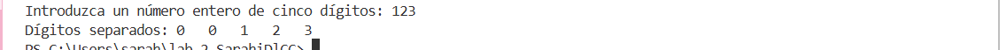
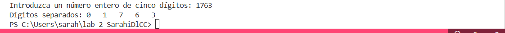

# Ejercicio de laboratorio 3 - Separación de dígitos

## Descripción

Escriba un programa que ingrese un número de cinco dígitos, divida el número en sus dígitos individuales e imprima los dígitos separados entre sí por tres espacios cada uno. [Sugerencia: use la división entera y el operador de módulo.] Por ejemplo, si el usuario ingresa 42339, el programa debe imprimir lo que se muestra en la salida de ejemplo.

```cmd
Introduzca un número entero de cinco dígitos: 42339
Dígitos separados: 4 2 3 3 9
```

## Contesta las siguientes preguntas

1. ¿Cuáles son los resultados de las siguientes expresiones?

   | Operación  | Resultado |
   | ---------- | --------- |
   | 24 / 5     |     4     |
   | 18 % 3     |     0     |
   | 13 % 9     |     4     |
   | 13 / 2 % 2 |     0     |

2. ¿Qué sucede cuando el usuario ingresa un número que tiene menos de cinco dígitos? ¿por qué?

Me agrega 0 en números, porque no puse un verificador de cantidad de dígitos, ahí me marcaría error o que ingrese 5 dígitos.


¿Cuál es la salida cuando se ingresa 1763?



3. El programa que completó en este ejercicio de laboratorio ingresa un número con varios dígitos y separa los dígitos. Escribe un programa inverso, un programa que le pide al usuario tres números de un dígito y los combina en un solo número de tres dígitos.


## ✅ Resultado

Código:


