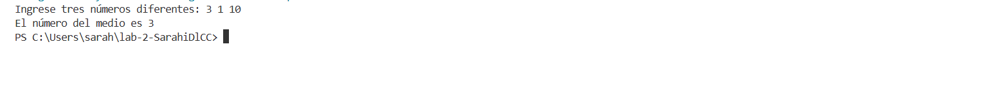
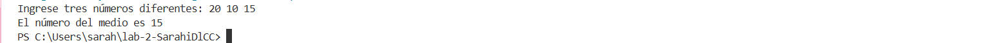

# Ejercicio de laboratorio 4 - Número de en medio

## Descripción

Escriba un programa de C ++ que lea tres números del teclado y encuentre el número del medio entre los tres números. Suponga que los tres números son diferentes. [Sugerencia: encuentre primero los valores más grandes y más pequeños.]

## ✅ Resultado

Código

